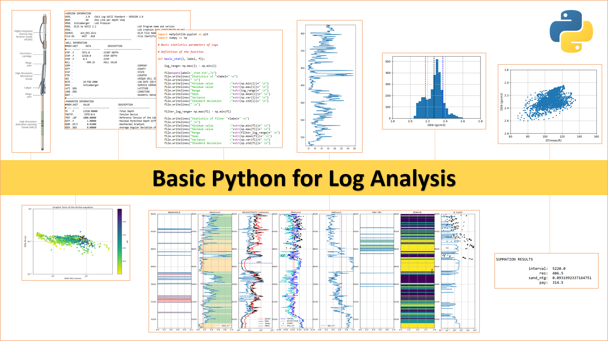

<h2>Course creator and speaker</h2>

Manuel **David** Soto. MSc in Geological Sciences, University of Texas at Austin, USA.

<h2>Organizer</h2>

USB-AAPG Student Chapter.

<h2>About this material</h2>

This was the core material of the online course Basic Python for Log Analysis, organized by the Universidad Simón Bolívar (USB) AAPG Student Chapter (Caracas, Venezuela), in January 2021. The course was organized by Ulises Berman and other students of Geophysical Engineering, all members of the chapter. In the course, 25 students and professionals from six countries participated: Argentina, Bolivia, Colombia, Peru, the USA, and Venezuela, the organizer country.

<h2>Objectives</h2>

Log analysis (LA) or petrophysics is the geosciences discipline that integrates and interprets all the data acquired in the initial life of the wells. Python (programming language) and its different libraries (both free) provide extraordinary and scalable tools for log analysis and other geoscience disciplines. The course covers basic tools (loading and writing information, plotting, basic statistics, execution of functions and formulas, summaries, regressions, …) of this general-porpoise programming language with direct application in LA. The participants have to do reinforcement homework exercises after every session.

<h2>Course format</h2>

The course is composed of an introduction (pdf not provided here) and 3 online sessions of 2 hours and 45 minutes (15-minute break). Before session 1, the participants have to read the introduction and install Python and Jupyter Notebook according to the instructions given in the introduction. Installation problems cannot be tackled during the sessions. Each session has a folder with its corresponding data, images, and Jupyter Notebooks (theory and exercises). Along the course, Jupyter Notebook is the environment that we use to develop our Python codes. The exercises are shown in all theoretical Notebooks (Session_1_variables_data_arrays_functions.ipynb) however, it is recommended to work the exercises in the Notebook intended just for that (Session_1_exercises.ipynb), in that way the theoretical Notebook is preserved for future references.

<h2>Attendees and requirements</h2>

Geoscientists and engineers with basic knowledge of open-hole log analysis. Personal computer with Internet connection.

<h2>Summarized table of contents</h2>

* Introduction (pdf not provided here): Coding. Python and its packages. Installing Python & Jupyter
* Session 1: Variables and  data types. Arrays. Python structure and functions
* Session 2: Flow control. Read and write text files. Plots. Basic statistics
* Session 3: Well information loading and verification. Parameters selection. Output logs and summation. Simple estimation of rock typing and K

